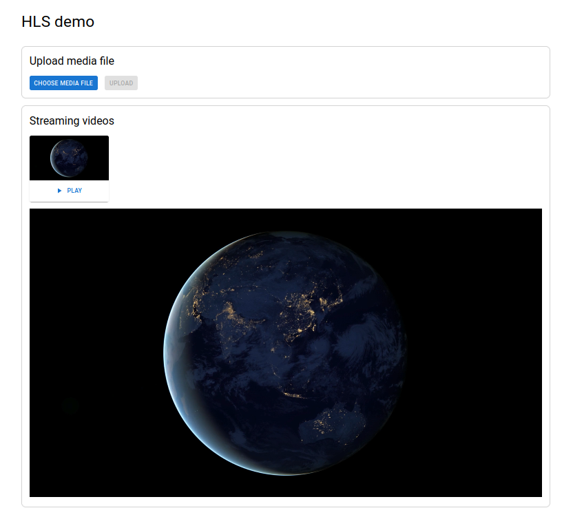

# HLS demo

This project demos HLS encoding and streaming the upload video.

## Prerequisite

Before starting it, ensure these packages are installed on your machine:

- [Nodejs](https://nodejs.org) version ^14.x.
- [FFMpeg](https://ffmpeg.org/): use to scale and encode video.

## How it works

- Video is uploaded to HTTP server.
- The video is scaled to 4 streams and encoded into HLS format by FFMpeg:
  - stream 1: 1080p, 30fps, BR 5M.
  - stream 2: 720p, 30fps, BR 3M.
  - stream 3: 480p, 30fps, BR 1M.
  - stream 4: 360p, 30fps, BR 1M.
- Streams are serverd on HTTP server.
- Client video player using [hls.js](https://github.com/video-dev/hls.js/) to load
and play HLS video.

## Scripts

- `npm install`: Install required npm packages.
- `npm run init-secrets`: Initialize the secrets file.
- `npm start`: Start server locally on port 3000.
- `npm test`: Run unit tests and integration tests. (Firstly, you need to put `video.mp4` into folder `express/test/files`)

## Screenshot

